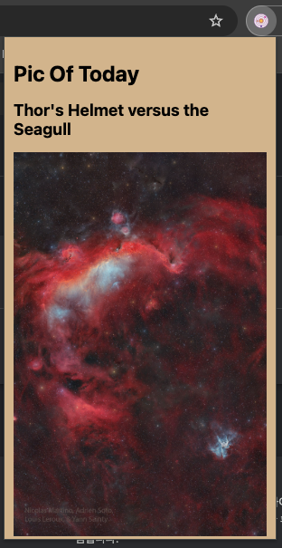

#  NASA Astronomy Picture of the Day Chrome Extension
## Description: 
This Chrome extension utilizes NASA's open API to fetch and display the Astronomy Picture of the Day (APOD). Each day, you can enjoy a new and breathtaking image of the universe right from your browser. With a simple click, the extension retrieves the latest APOD and displays it in a visually appealing popup. Stay connected with the wonders of the cosmos and make your browsing experience more astronomical!

## Features:
Fetches the Astronomy Picture of the Day from NASA's open API.
Displays the daily image along with its description.
Easy to use and access right from the browser toolbar.

## How to Use:
Install the extension from the Chrome Web Store.
Click on the extension icon in the toolbar.
Enjoy the Astronomy Picture of the Day!

## Looks like...

